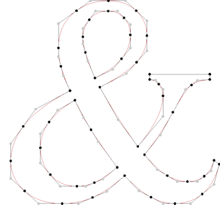

# User Guide

For technical details on various data formats, refer to [the developer
guide](https://font-bakers.github.io/knead/developer-guide/).

## Glyphs, contours and Bezier curves

Before explaining `knead`'s internals, it is necessary to introduce how vector
typefaces are represented.

1. A typeface is composed of one or more fonts.
2. A font is composed of several glyphs.
3. A glyph is composed of one or more (closed) contours.
4. A contour is composed of several [Bezier
   curves](https://en.wikipedia.org/wiki/B%C3%A9zier_curve). [Quadratic Bezier
   curves](https://en.wikipedia.org/wiki/B%C3%A9zier_curve#Quadratic_B%C3%A9zier_curves)
   are by far the most common.
5. A (quadratic) Bezier curve is composed of exactly three control points.
6. A control point is composed of an x and a y coordinate.

The following image illustrates all these concepts. The ampersand is composed of
three contours (one outer contour and two more for each counter space).

Each contour is red, and is composed of several Bezier curves. Each Bezier curve
is given by a black-grey-black sequence of points, denoting the on-off-on curve
control points. (Note that the linear interpolations of each pair of control
points _is not the same_ as the Bezier curve, which is an interpolation of the
interpolations).



## The `knead` data pipeline

Under the hood, the data conversion pipeline looks like this:

```
----------      ----------     -----------     ---------     ----------
|  .ttf  | -->  |  .ttx  | --> |  .json  | --> |  .pb  | --> |  .npy  |
----------      ----------     -----------     ---------     ----------
```

Each conversion between two data formats is explained in a different section
below.

### `.ttf` to `.ttx`

This conversion is handled by the `fonttools` `ttx` command line utility. For
more information, refer to the [`fonttools`
documentation](https://github.com/fonttools/fonttools#ttx--from-opentype-and-truetype-to-xml-and-back).

Running `knead --input ttf --output ttx MyFont.ttf` is essentially a thin callthrough to
`ttx -q -o MyFont.ttx MyFont.ttf`.

Refer to [the developer guide](https://font-bakers.github.io/knead/developer-guide/)
for more information on the `.ttf` and `.ttx` file formats.

### `.ttx` to `.json`

This is done in Python, using the `xml` library, and following all the TrueType
rules described above.

The JSON object is structured as a dictionary, keyed by the character (e.g.
`"A"` or `"exclam"`), and valued by quadruply-nested lists. The four layers of
nesting are best explained by code:

```python
with open("MyFont.json", "r") as f:
    font = json.read(f)

glyph = font["A"]
assert len(glyph) == num_contours_in_glyph

contour = glyph[0]
assert len(contour) == num_beziers_in_contour

bezier = glyph[0]
assert len(bezier) == 3  # Number of control points in a quadratic Bezier curve

control_point = bezier[0]
assert len(control_point) = 2  # x and y coordinates
```

### `.json` to `.pb`

This is done in Python, using the `protobuf` library.

Refer to the [developer
guide](https://font-bakers.github.io/knead/developer-guide/#protocol-buffers-protobufs)
for more information on what protocol buffers are and how `knead` uses them.

Note that `.pb` files are saved with `_upper` and `_lower` since some file
systems do not distinguish between uppercase and lowercase filenames.

### `.pb` to `.npy`

This is done in Python, using the `numpy` library.

Note that unlike all other conversions, a single `.pb` file can be converted to
_several_ `.npy` files (e.g. by changing the number of samples per Bezier curve
via `--num_samples`, etc.)

## Miscellaneous notes

- It is possible to run the data pipeline in reverse: e.g. we can convert `.ttx`
  files back to `.ttf` files, and it is theoretically possible to convert
  `.json` files back into `.ttx` files, etc. _This is currently not a
  development priority._

- `.ttf` is the only font file format currently supported: in particular, `.otf`
  files are not supported.
