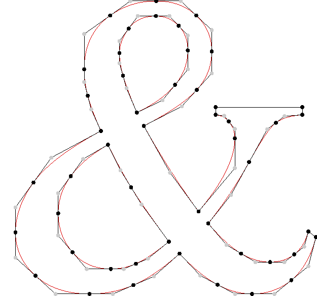

# User Guide

## Bezier curves and the TrueType standard

Before explaining `knead`'s internals, it is necessary to introduce how vector
typefaces are represented.

1. A typeface is composed of one or more fonts.
2. A font is composed of several glyphs.
3. A glyph is composed of one or more (closed) contours.
4. A contour is composed of several [(quadratic) Bezier
   curves](https://en.wikipedia.org/wiki/B%C3%A9zier_curve#Quadratic_B%C3%A9zier_curves).
5. A (quadratic) Bezier curve is composed of exactly three control points.
6. A control point is composed of an x and a y coordinate.



In a `.ttx` (a.k.a. TrueType XML) file, each glyph is contained within a
`<ttGlyph>` tag. This tag has several `<contour>` definitions.

Within each contour we have successive `<pt>` tags which define control points.
Each control point specifies its location (i.e., x and y coordinates) and
whether the point is "on curve" or "off curve".

There are some important rules on how to understand these points.

1. If two successive points are "on" this means that they form a line.
2. If three points are "on", "off", "on" then this defines a quadratic Bezier
   curve.
3. If there are several "off" points with no "on" point in between them, there
   is a virtual "on" point in the middle of the two "off" points. This is a form
   of data compression.
4. If the first point in a contour is an "off" point go to the last point and
   start from there. If the last point is also "off" start with a virtual "on"
   in between the first and the last one.

### References

1. [_Glyph Hell_ by David
   Turner](http://chanae.walon.org/pub/ttf/ttf_glyphs.htm)
2. [The _FreeType Glyph Conventions_
   documentation](https://www.freetype.org/freetype2/docs/glyphs/glyphs-6.html)
3. [This StackOverflow
   thread](https://stackoverflow.com/questions/20733790/truetype-fonts-glyph-are-made-of-quadratic-bezier-why-do-more-than-one-consecu)

## The `knead` data pipeline

Under the hood, the data conversion pipeline looks like this:

```
----------      ----------     -----------     ------------     ----------
|  .ttf  | -->  |  .ttx  | --> |  .json  | --> |  .proto  | --> |  .npy  |
----------      ----------     -----------     ------------     ----------
```

Each conversion between two data formats is explained in a different section
below.

### `.ttf` to `.ttx`

This conversion is handled by the `fonttools` `ttx` command line utility. For
more information, refer to the [`fonttools`
documentation](https://github.com/fonttools/fonttools#ttx--from-opentype-and-truetype-to-xml-and-back).

Running `knead --input ttf --output ttx MyFont.ttf` is essentially a thin callthrough to
`ttx -q -o MyFont.ttx MyFont.ttf`.

### `.ttx` to `.json`

This is done in Python, following all the TrueType rules described above.

### `.json` to `.proto`

Protos are saved with `_upper` and `_lower` since some filesystems do not
distinguish between uppercase and lowercase filenames.

### `.proto` to `.npy`

This _samples_ from the quadratic Bezier curves.

## Notes

- It is possible to run the data pipeline in reverse: e.g. we can convert `.ttx`
  files back to `.ttf` files, and it is theoretically possible to convert
  `.json` files back into `.ttx` files, etc. _This is currently not a
  development priority._

- `.ttf` is the only font file format currently supported: in particular, `.otf`
  files are not supported.
